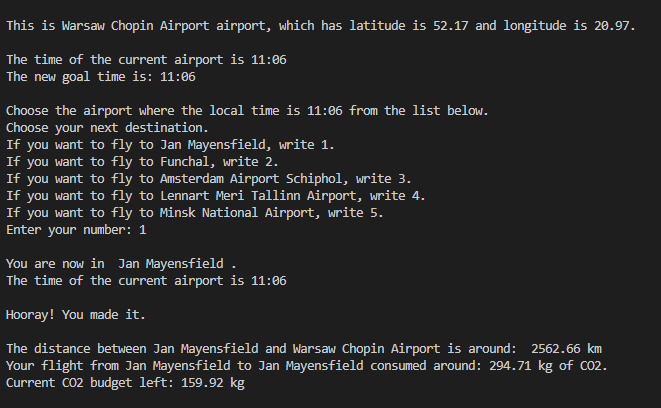

# Metropolia Project: Flight Game

This is a text-based game and it helps users to learn about different time and time zone by traveliing airports around the world.

<p align="center">
  
</p>

## 💻 Tech stacks

- Language: Python, SQL
- API: https://timeapi.io
- DB management system: MySQL

## 🗒️ Overview

- `_main.py` - This is the file where all logics from different files are combined together.
- `user.py` - The user's key information in order to proceed the game.
- `current_gps.py` - Get the longitude and latitude of an airport. DB is connected in this file.
- `current_time.py` - Calculate the current time of the airport.
- `game_goal.py` - All logics to generate a game goal (time in a different time zone).
- `rand_airport.py` - Logics to generate a random airport or a list of airports.
- `user_input.py` - Functions to take user's inputs.
- `co2.py` - Calculate the user's co2 budget left.
- `message.py` - All messages(success, failure, game over) to provide as feedback to the user.
- `lib.py` - Miscellaneous functions used in the project.

## ⚙️ Running the project locally

```
git clone https://github.com/chepark/flight-game.git
cd _main.py
```

Then run the \_main.py file in your code editor.
